# 🎯 IELTS Prediction — Tài liệu Walkthrough toàn diện

> **Dự án**: Nền tảng luyện thi IELTS trực tuyến (Reading + Listening)
> **Stack**: Next.js (Pages Router) + Supabase + TypeScript
> **Cập nhật**: 2026-03-11

---

## 📋 Mục lục

1. [Tổng quan kiến trúc](#1-tổng-quan-kiến-trúc)
2. [Database Schema — 18 bảng](#2-database-schema--18-bảng)
3. [Kiểu dữ liệu (Types)](#3-kiểu-dữ-liệu-types)
4. [Luồng đăng nhập / xác thực (Auth)](#4-luồng-đăng-nhập--xác-thực-auth)
5. [Luồng tạo câu hỏi (Quiz CRUD)](#5-luồng-tạo-câu-hỏi-quiz-crud)
6. [Luồng làm bài thi (Test Flow)](#6-luồng-làm-bài-thi-test-flow)
7. [Luồng chấm điểm (Scoring Engine)](#7-luồng-chấm-điểm-scoring-engine)
8. [Luồng xem kết quả (Test Result)](#8-luồng-xem-kết-quả-test-result)
9. [Hệ thống Exam Collection](#9-hệ-thống-exam-collection)
10. [Luồng thanh toán & Pro Account](#10-luồng-thanh-toán--pro-account)
11. [Hệ thống Affiliate](#11-hệ-thống-affiliate)
12. [CMS & Admin Panel](#12-cms--admin-panel)
13. [Blog & Sample Essays](#13-blog--sample-essays)
14. [Hệ thống Email](#14-hệ-thống-email)
15. [Device Fingerprint](#15-device-fingerprint)
16. [API Routes tổng hợp](#16-api-routes-tổng-hợp)

---

## 1. Tổng quan kiến trúc

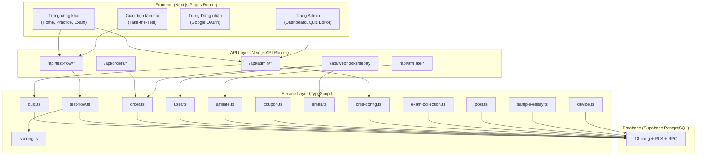

### Cấu trúc thư mục chính

| Thư mục | Mô tả |
|---------|--------|
| [pages/](file:///d:/Projects/IELTS-Prediction/pages) | Next.js pages + API routes |
| [src/](file:///d:/Projects/IELTS-Prediction/src) | Components theo Feature-Sliced Design |
| [services/](file:///d:/Projects/IELTS-Prediction/services) | Business logic layer (13 service files) |
| [lib/](file:///d:/Projects/IELTS-Prediction/lib) | Utilities, Supabase clients, auth helpers |
| [supabase/](file:///d:/Projects/IELTS-Prediction/supabase) | Database migrations |
| [config/](file:///d:/Projects/IELTS-Prediction/config) | CMS config data (JSON) |
| [data/](file:///d:/Projects/IELTS-Prediction/data) | Migration data (legacy WP users, orders) |

---

## 2. Database Schema — 18 bảng

> [!NOTE]
> Toàn bộ schema được định nghĩa tại [001_initial_schema.sql](file:///d:/Projects/IELTS-Prediction/supabase/migrations/001_initial_schema.sql)

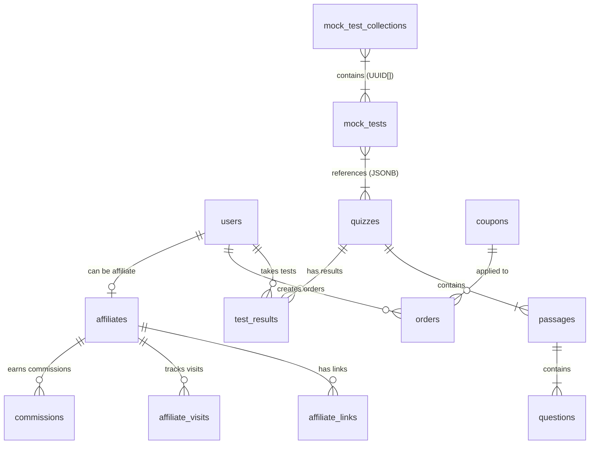

### Chi tiết 18 bảng

````carousel
### 📦 Nhóm Core: Quiz System (4 bảng)

| Bảng | Mô tả | Quan hệ |
|------|--------|---------|
| **quizzes** | Đề thi (reading/listening, practice/exam) | Parent |
| **passages** | Đoạn văn/audio segment trong quiz | → `quizzes.id` (CASCADE) |
| **questions** | Câu hỏi (6 loại) trong passage | → `passages.id` (CASCADE) |
| **test_results** | Kết quả làm bài của user | → `users.id`, `quizzes.id` |
<!-- slide -->
### 👤 Nhóm User & Commerce (4 bảng)

| Bảng | Mô tả | Quan hệ |
|------|--------|---------|
| **users** | Profile mở rộng từ `auth.users` | PK = `auth.users.id` |
| **orders** | Đơn hàng mua gói Pro | → `users.id`, `coupons.id` |
| **coupons** | Mã giảm giá | Standalone |
| **mock_tests** | Nhóm bài thi (reading + listening) | JSONB → `quizzes.id` |
<!-- slide -->
### 🤝 Nhóm Affiliate (4 bảng)

| Bảng | Mô tả | Quan hệ |
|------|--------|---------|
| **affiliates** | Đăng ký affiliate | → `users.id` |
| **affiliate_links** | Link giới thiệu | → `affiliates.id` |
| **affiliate_visits** | Tracking lượt click | → `affiliates.id`, `affiliate_links.id` |
| **commissions** | Hoa hồng | → `affiliates.id` |
<!-- slide -->
### ⚙️ Nhóm CMS & Content (6 bảng)

| Bảng | Mô tả | Quan hệ |
|------|--------|---------|
| **mock_test_collections** | Bộ đề thi (e.g., Cambridge 18) | UUID[] → `mock_tests.id` |
| **cms_configs** | Config CMS (hero banner, pricing...) | key-value |
| **site_settings** | Settings website (logo, favicon...) | key-value |
| **menus** | Menu navigation | key-value |
| **posts** | Blog posts | Standalone |
| **sample_essays** | Bài mẫu Speaking/Writing | Standalone |
````

---

## 3. Kiểu dữ liệu (Types)

> [!IMPORTANT]
> Types được định nghĩa tại 2 file:
> - [services/types/database.ts](file:///d:/Projects/IELTS-Prediction/services/types/database.ts) — Types chính cho toàn bộ hệ thống
> - [services/types/quiz.ts](file:///d:/Projects/IELTS-Prediction/services/types/quiz.ts) — Types riêng cho Scoring Engine

### 3.1 Enums & Constants

```typescript
type QuizType = "practice" | "exam";
type SkillType = "reading" | "listening";
type QuestionType = "radio" | "select" | "fillup" | "checkbox" | "matching" | "matrix";
type MatchingLayoutType = "standard" | "summary" | "heading";
type ContentStatus = "draft" | "published";
type OrderStatus = "pending" | "completed" | "cancelled";
type PackageType = "combo" | "single";
type CouponType = "percent" | "fixed";
```

### 3.2 Cấu trúc 6 loại câu hỏi (Question Types)

Đây là phần phức tạp nhất của hệ thống. Mỗi loại câu hỏi lưu data ở các JSONB column khác nhau:

````carousel
### 1️⃣ Radio — Trắc nghiệm 1 đáp án

```typescript
// Lưu tại: questions.list_of_questions
type RadioSelectQuestion = {
    question: string;           // "What is the main idea?"
    correct: string;            // "1" (index dạng string)
    options: RadioSelectOption[]; // [{option_text: "A"}, {option_text: "B"}]
};
```

**Cách chấm**: So sánh `String(userAnswer) === String(correct)`

Mỗi sub-question tiêu tốn **1 slot** trong mảng answers.

<!-- slide -->
### 2️⃣ Select — Dropdown chọn đáp án

```typescript
// Cùng cấu trúc với Radio
// Lưu tại: questions.list_of_questions
type RadioSelectQuestion = {
    question: string;
    correct: string;
    options: RadioSelectOption[];
};
```

**Cách chấm**: Giống hệt Radio. Mỗi sub-question = 1 slot.

<!-- slide -->
### 3️⃣ Fillup — Điền vào chỗ trống

```typescript
// Đáp án lưu tại: questions.explanations
type Explanation = {
    content: string;  // "correct answer 1 / alternate answer"
};
```

**Cách chấm**: 
- Tách theo `/` để có nhiều đáp án chấp nhận
- So sánh case-insensitive
- Mỗi explanation = 1 slot

<!-- slide -->
### 4️⃣ Checkbox — Chọn nhiều đáp án

```typescript
// Lưu tại: questions.list_of_options
type CheckboxOption = {
    option_text: string;
    correct: boolean;  // true nếu là đáp án đúng
};
```

**Cách chấm**: 
- **All-or-nothing**: Phải chọn đúng **toàn bộ** tập đáp án
- User answer: mảng indices `[0, 2, 4]`
- 1 checkbox question = **1 slot** duy nhất

<!-- slide -->
### 5️⃣ Matching — 3 sub-layouts

```typescript
// Lưu tại: questions.matching_question
type MatchingQuestionData = {
    layout_type: "standard" | "summary" | "heading";
    matching_items: MatchingItem[];      // Câu hỏi
    answer_options: AnswerOption[];      // Đáp án để chọn
    summary_text: string | null;        // Text có {gaps} cho summary layout
};
```

**3 layout**:
- **Standard**: Kéo thả/chọn đáp án cho từng matching item
- **Summary**: Điền gap `{...}` trong summary_text
- **Heading**: Điền gap `{...}` trong passage content

**User answer**: Object map `{0: "option-0-2", 1: "option-1-0", ...}`

<!-- slide -->
### 6️⃣ Matrix — Phân loại vào category

```typescript
// Lưu tại: questions.matrix_question
type MatrixQuestionData = {
    matrix_categories: MatrixCategory[];  // [{category_letter: "A", category_text: "..."}]
    matrix_items: MatrixItem[];          // [{item_text: "...", correct_category_letter: "A"}]
};
```

**Cách chấm**: 
- User answer: Object map `{0: "cat-0-1", 1: "cat-1-0"}`
- Trích category index từ format `"cat-{questionIdx}-{catIdx}"`
- So sánh `category_letter` với `correct_category_letter`
````

### 3.3 Cấu trúc lồng nhau Quiz → Passage → Question

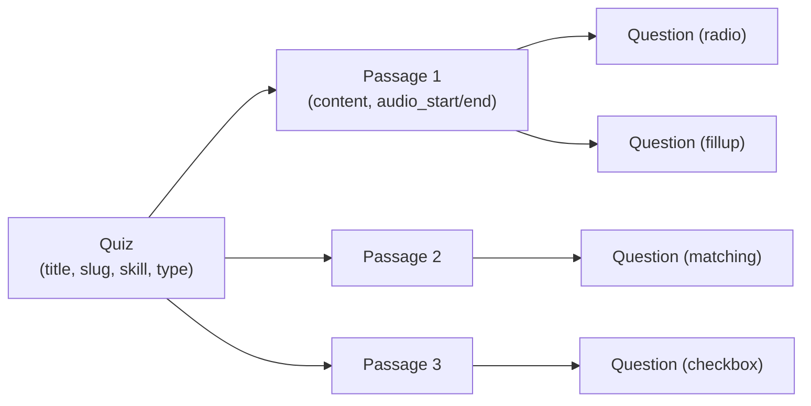

```typescript
type QuizWithPassages = Quiz & {
    passages: PassageWithQuestions[];
};

type PassageWithQuestions = Passage & {
    questions: Question[];
};
```

---

## 4. Luồng đăng nhập / xác thực (Auth)

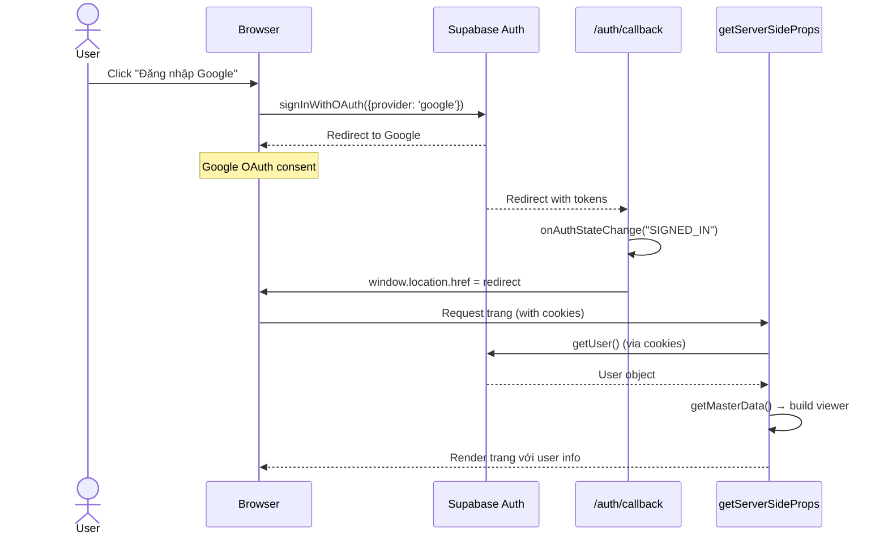

### Các thành phần Auth

| File | Vai trò |
|------|---------|
| [lib/supabase/client.ts](file:///d:/Projects/IELTS-Prediction/lib/supabase/client.ts) | Browser Supabase client |
| [lib/supabase/server.ts](file:///d:/Projects/IELTS-Prediction/lib/supabase/server.ts) | SSR + API Supabase client |
| [lib/supabase/admin.ts](file:///d:/Projects/IELTS-Prediction/lib/supabase/admin.ts) | Admin client (service_role, bypass RLS) |
| [lib/admin-auth.ts](file:///d:/Projects/IELTS-Prediction/lib/admin-auth.ts) | [requireAdmin()](file:///d:/Projects/IELTS-Prediction/lib/admin-auth.ts#7-47) helper |
| [lib/parseRoles.ts](file:///d:/Projects/IELTS-Prediction/lib/parseRoles.ts) | Parse roles đa format |
| [pages/auth/callback.tsx](file:///d:/Projects/IELTS-Prediction/pages/auth/callback.tsx) | OAuth callback handler |

### Role System

```typescript
// Roles lưu dạng JSONB: ["subscriber"] hoặc ["administrator"]
// parseRoles() xử lý 4 format đầu vào:
// - Array: ['administrator']
// - JSON string: '["administrator"]'
// - Plain string: 'administrator'
// - null → fallback ["subscriber"]

function isAdminRole(roles: unknown): boolean {
    return parseRoles(roles).includes("administrator") || parseRoles(roles).includes("admin");
}
```

### RLS (Row Level Security)

Mỗi bảng đều bật RLS. Pattern chung:

| Bảng | Đọc (SELECT) | Ghi (INSERT/UPDATE/DELETE) |
|------|--------------|--------------------------|
| quizzes | `status = 'published'` (public) | Admin only |
| passages | Quiz phải `published` | Admin only |
| questions | Quiz phải `published` (qua JOIN) | Admin only |
| test_results | `auth.uid() = user_id` | `auth.uid() = user_id` |
| orders | `auth.uid() = user_id` | Admin only |
| users | `auth.uid() = id` | `auth.uid() = id` |

---

## 5. Luồng tạo câu hỏi (Quiz CRUD)

> [!NOTE]
> Quiz CRUD nằm tại [services/quiz.ts](file:///d:/Projects/IELTS-Prediction/services/quiz.ts)
> Admin UI tại [pages/admin/quizzes/[id].tsx](file:///d:/Projects/IELTS-Prediction/pages/admin/quizzes/%5Bid%5D.tsx)

### 5.1 Tạo Quiz mới ([createQuiz](file:///d:/Projects/IELTS-Prediction/services/quiz.ts#220-289))

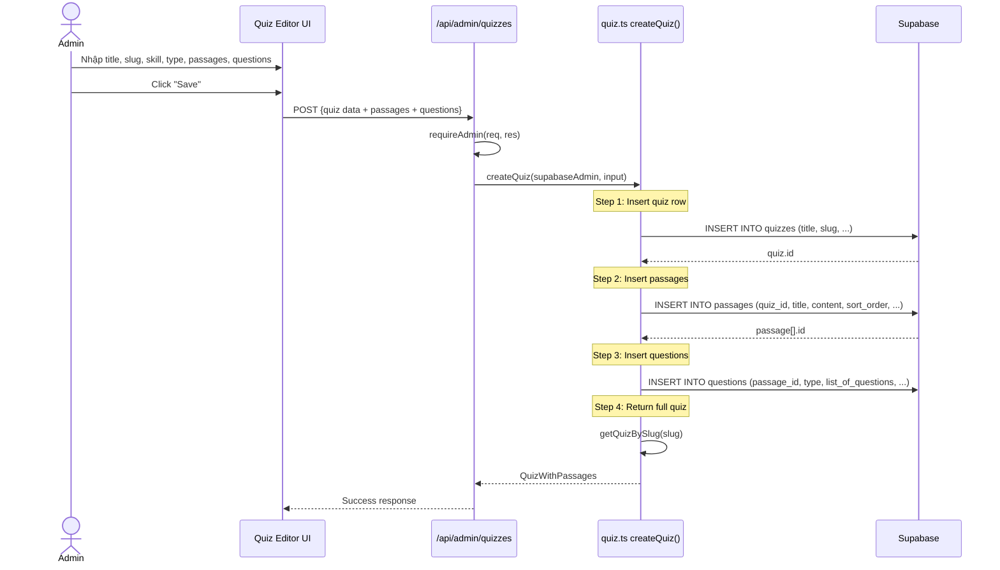

### 5.2 Cập nhật Quiz ([updateQuiz](file:///d:/Projects/IELTS-Prediction/services/quiz.ts#302-393))

Chiến lược **Delete-and-Reinsert** cho passages/questions:

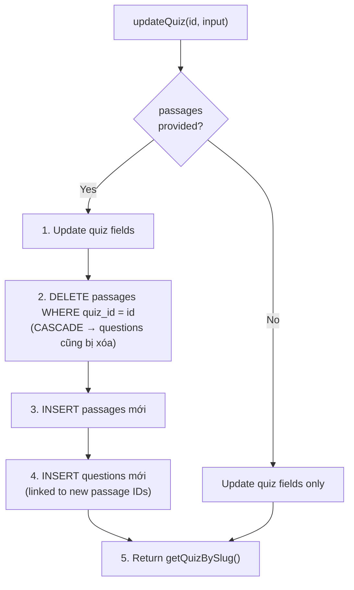

> [!WARNING]
> Mỗi lần update passages/questions, **toàn bộ** data cũ bị xóa và re-insert. Điều này đơn giản hơn diff-based update nhưng sẽ tạo UUID mới cho mỗi passage/question.

### 5.3 Cấu trúc dữ liệu khi tạo câu hỏi

Mỗi **Quiz** chứa nhiều **Passage**, mỗi Passage chứa nhiều **Question**. Tùy theo `question.type`, admin điền data vào các field JSONB khác nhau:

| Question Type | Field chính được sử dụng | Mô tả |
|---------------|-------------------------|--------|
| `radio` | `list_of_questions` | Mảng sub-questions, mỗi cái có options + correct index |
| `select` | `list_of_questions` | Giống radio, UI khác (dropdown) |
| `fillup` | `explanations` | Mảng đáp án, mỗi cái hỗ trợ `"đáp án 1 / đáp án 2"` |
| `checkbox` | `list_of_options` | Mảng options, `correct: true/false` |
| `matching` | `matching_question` | 3 layout: standard, summary, heading |
| `matrix` | `matrix_question` | Categories + items |

---

## 6. Luồng làm bài thi (Test Flow)

> [!IMPORTANT]
> Đây là luồng phức tạp nhất, bao gồm 3 API endpoints:
> - [start.ts](file:///d:/Projects/IELTS-Prediction/pages/api/test-flow/start.ts) — Bắt đầu bài thi
> - [save-draft.ts](file:///d:/Projects/IELTS-Prediction/pages/api/test-flow/save-draft.ts) — Auto-save đáp án
> - [submit.ts](file:///d:/Projects/IELTS-Prediction/pages/api/test-flow/submit.ts) — Nộp bài + chấm điểm

### 6.1 Bắt đầu bài thi ([takeTheTest](file:///d:/Projects/IELTS-Prediction/services/test-flow.ts#141-237))

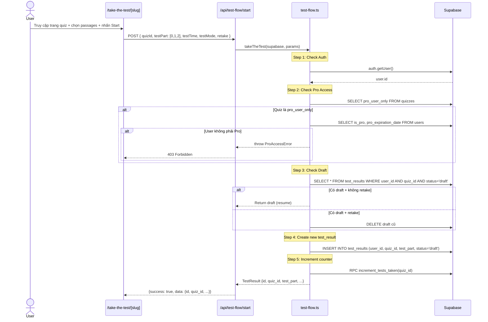

### 6.2 Auto-save đáp án ([saveTestResult](file:///d:/Projects/IELTS-Prediction/services/test-flow.ts#242-272))

Trong khi user đang làm bài, frontend định kỳ gọi API để lưu nháp:

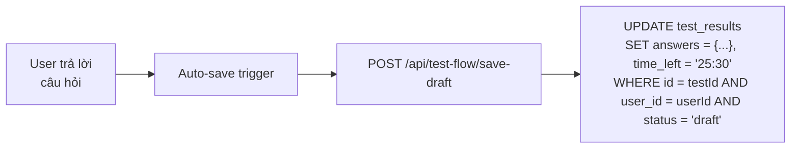

### 6.3 Nộp bài ([submitTestResult](file:///d:/Projects/IELTS-Prediction/services/test-flow.ts#277-349))

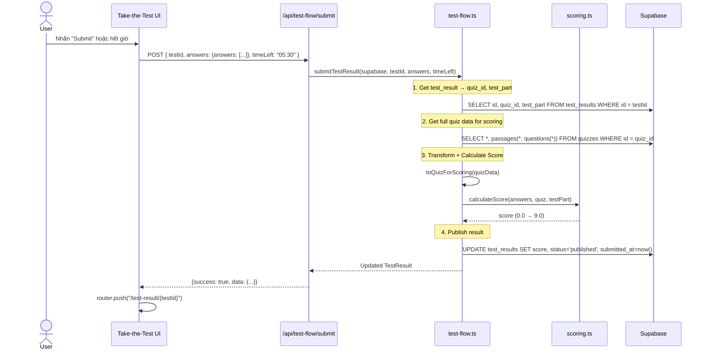

### 6.4 ExamContext — State management khi làm bài

File [context.tsx](file:///d:/Projects/IELTS-Prediction/src/pages/take-the-test/context.tsx) quản lý toàn bộ state:

| State | Mô tả |
|-------|--------|
| `post` | Dữ liệu quiz (passages + questions) |
| `testID` | ID của test_result đang làm |
| `part.current` | Passage đang hiển thị |
| `timer` | Đồng hồ đếm ngược |
| `isFormDisabled` | Disable form khi đã submit |
| `activeQuestionIndex` | Câu hỏi đang active (scroll-to) |
| [getQuestionStartIndex()](file:///d:/Projects/IELTS-Prediction/src/pages/take-the-test/context.tsx#102-103) | Tính index bắt đầu cho mỗi question (dựa trên position trong quiz) |
| `savedPassageData` | Notes + highlights per passage |
| [handleSubmitAnswer()](file:///d:/Projects/IELTS-Prediction/src/pages/take-the-test/context.tsx#89-90) | Gọi API submit + redirect |

### 6.5 Format mảng câu trả lời (`answers`)

Mảng `answers` là mảng **phẳng** (flat array), mỗi phần tử tương ứng với **1 unit trả lời**:

```typescript
type AnswerFormValues = {
    answers: (string | number[] | object)[];
    // Ví dụ cho quiz có 3 passages × nhiều questions:
    // answers[0] = "1"           ← radio: chọn option index 1
    // answers[1] = "2"           ← radio: chọn option index 2
    // answers[2] = "london"      ← fillup: nhập text
    // answers[3] = "paris"       ← fillup: nhập text
    // answers[4] = [0, 2, 4]     ← checkbox: chọn indices 0,2,4
    // answers[5] = {0: "option-0-2", 1: "option-1-0"} ← matching: map
    // answers[6] = {0: "cat-0-1", 1: "cat-1-0"}       ← matrix: map
};
```

**Quy tắc tiêu thụ slot**:
- **radio/select**: Mỗi sub-question trong `list_of_questions` tiêu thụ **1 slot**
- **fillup**: Mỗi explanation tiêu thụ **1 slot**
- **checkbox**: Toàn bộ question chỉ tiêu thụ **1 slot** (array of indices)
- **matching**: Toàn bộ question chỉ tiêu thụ **1 slot** (object map)
- **matrix**: Toàn bộ question chỉ tiêu thụ **1 slot** (object map)

---

## 7. Luồng chấm điểm (Scoring Engine)

> [!NOTE]
> Scoring engine: [services/scoring.ts](file:///d:/Projects/IELTS-Prediction/services/scoring.ts)
> Port 1:1 từ PHP `calculate_score()` (functions.php L1014–1452)

### 7.1 Tổng quan thuật toán

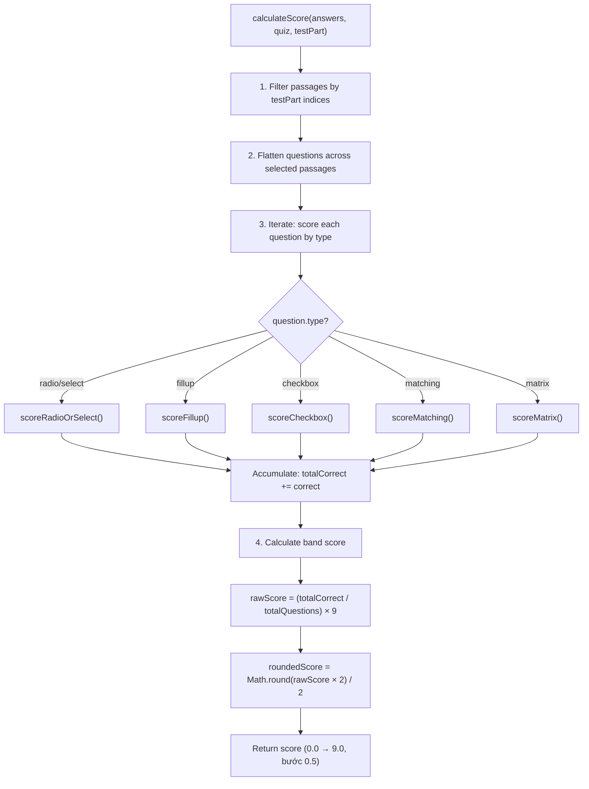

### 7.2 Chi tiết chấm điểm từng loại

| Type | Hàm | Logic chấm | Tiêu thụ slots |
|------|------|-----------|----------------|
| `radio` | [scoreRadioOrSelect()](file:///d:/Projects/IELTS-Prediction/services/scoring.ts#51-80) | `String(userAnswer) === String(correct)` | N slots (N = sub-questions) |
| `select` | [scoreRadioOrSelect()](file:///d:/Projects/IELTS-Prediction/services/scoring.ts#51-80) | Giống radio | N slots |
| `fillup` | [scoreFillup()](file:///d:/Projects/IELTS-Prediction/services/scoring.ts#81-114) | Case-insensitive, hỗ trợ `/` separator | N slots (N = explanations) |
| `checkbox` | [scoreCheckbox()](file:///d:/Projects/IELTS-Prediction/services/scoring.ts#115-153) | **All-or-nothing**: sorted user indices === sorted correct indices | 1 slot |
| `matching` | [scoreMatching()](file:///d:/Projects/IELTS-Prediction/services/scoring.ts#154-240) | 3 sub-logic theo layout_type | 1 slot |
| `matrix` | [scoreMatrix()](file:///d:/Projects/IELTS-Prediction/services/scoring.ts#241-286) | So sánh category_letter | 1 slot |

### 7.3 Matching — 3 layout chi tiết

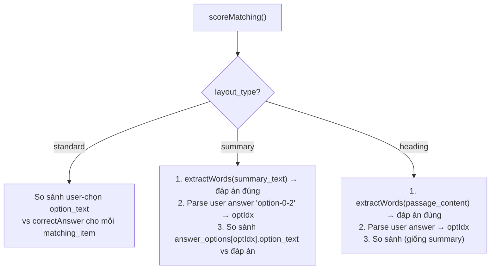

### 7.4 Công thức tính điểm IELTS

```
rawScore = (totalCorrect / totalQuestions) × 9
finalScore = Math.round(rawScore × 2) / 2   // Làm tròn 0.5
```

Ví dụ:
- 30/40 đúng → raw = 6.75 → `round(6.75 × 2) / 2` = `round(13.5) / 2` = `14 / 2` = **7.0**
- 27/40 đúng → raw = 6.075 → `round(12.15) / 2` = `12 / 2` = **6.0**

---

## 8. Luồng xem kết quả (Test Result)

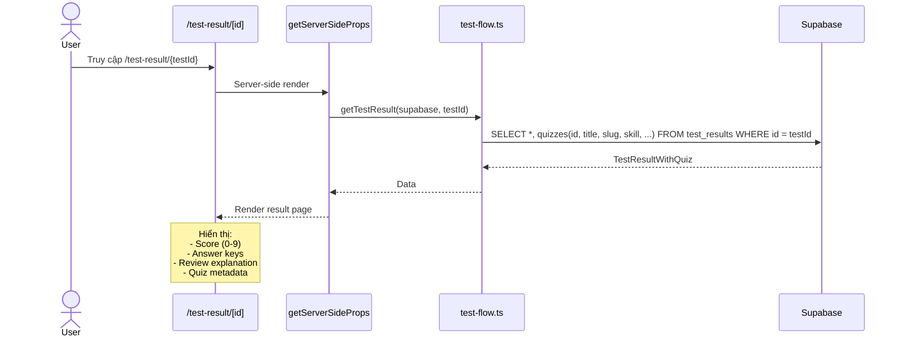

### Các component xem kết quả

| Component | Đường dẫn | Chức năng |
|-----------|-----------|-----------|
| Answer Keys | `src/pages/test-result/ui/answer-keys/` | Hiển thị đáp án đúng/sai |
| Review Explanation | `src/pages/test-result/ui/review-explanation/` | Giải thích chi tiết từng câu |

---

## 9. Hệ thống Exam Collection

> [!NOTE]
> Service: [services/exam-collection.ts](file:///d:/Projects/IELTS-Prediction/services/exam-collection.ts)
> Cấu trúc **3 tầng lồng nhau**: Collection → MockTest → Quiz

```mermaid
graph TD
    C["MockTestCollection<br/>(e.g., 'Cambridge 18')"]
    MT1["MockTest 1<br/>(Test 1)"]
    MT2["MockTest 2<br/>(Test 2)"]
    MT3["MockTest 3<br/>(Test 3)"]
    RQ1["Quiz Reading<br/>(skill: reading)"]
    LQ1["Quiz Listening<br/>(skill: listening)"]
    RQ2["Quiz Reading"]
    LQ2["Quiz Listening"]
    
    C -->|mock_test_ids UUID[]| MT1
    C -->|mock_test_ids UUID[]| MT2
    C -->|mock_test_ids UUID[]| MT3
    MT1 -->|practice_tests JSONB| RQ1
    MT1 -->|practice_tests JSONB| LQ1
    MT2 -->|practice_tests JSONB| RQ2
    MT2 -->|practice_tests JSONB| LQ2
```

### Luồng resolve 3 tầng

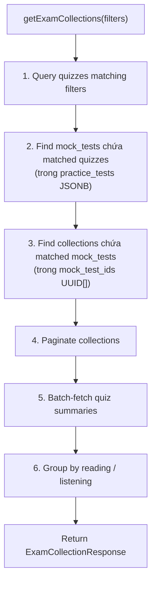

---

## 10. Luồng thanh toán & Pro Account

### 10.1 Luồng thanh toán tổng quát

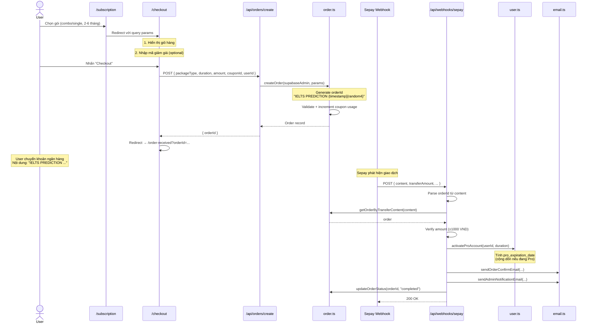

### 10.2 Pro Account Logic

```typescript
// Tính ngày hết hạn Pro (cộng dồn)
function calculateProExpirationDate(
    currentExpirationDate: string | null,
    duration: number,       // Số tháng
    isPro: boolean
): string {
    // Nếu đang Pro + chưa hết hạn → cộng thêm tháng vào ngày hiện tại
    // Nếu chưa Pro hoặc hết hạn → cộng từ now()
}
```

### 10.3 Gói subscription

| Gói | Kỹ năng | Thời hạn |
|-----|---------|----------|
| **Combo** | Listening + Reading | 3-6 tháng |
| **Single** | Listening HOẶC Reading | 2-6 tháng |

> Giá được cấu hình động qua `cms_configs` (section: `subscription/course-packages`)

---

## 11. Hệ thống Affiliate

> Service: [services/affiliate.ts](file:///d:/Projects/IELTS-Prediction/services/affiliate.ts)

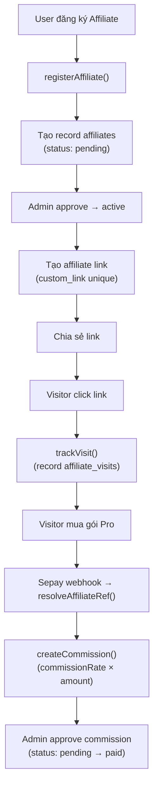

### Thống kê Affiliate

```typescript
type AffiliateStats = {
    totalBalance: number;       // Hoa hồng chờ thanh toán
    totalCommissions: number;   // Tổng hoa hồng
    totalVisits: number;        // Tổng lượt click
    totalConversions: number;   // Lượt chuyển đổi
    conversionRate: number;     // Tỷ lệ chuyển đổi (%)
    pendingCommissions: number; // Chờ thanh toán
    paidCommissions: number;    // Đã thanh toán
};
```

---

## 12. CMS & Admin Panel

### Admin Panel Routes

| Route | Chức năng |
|-------|----------|
| `/admin` | Dashboard tổng quan |
| `/admin/quizzes` | Quản lý đề thi CRUD |
| `/admin/quizzes/[id]` | Editor quiz (passages + questions) |
| `/admin/users` | Quản lý users |
| `/admin/orders` | Quản lý đơn hàng |
| `/admin/posts` | Quản lý blog posts |
| `/admin/sample-essays` | Quản lý bài mẫu |
| `/admin/coupons` | Quản lý mã giảm giá |
| `/admin/affiliate` | Quản lý affiliate |
| `/admin/home` | Editor trang chủ (hero, sections) |
| `/admin/header` | Editor header/menu |
| `/admin/footer` | Editor footer |
| `/admin/subscription` | Config gói subscription |
| `/admin/settings` | Site settings |
| `/admin/test-results` | Xem test results |

### CMS Config System

```typescript
// CMS configs lưu trong bảng cms_configs
// section_name → data (JSONB)

// Đọc config
const heroData = await readConfig<HeroBannerConfig>(supabase, "home/hero-banner");

// Ghi config (upsert)
await writeConfig(supabase, "home/hero-banner", newData);
```

---

## 13. Blog & Sample Essays

### Blog Posts

| Service | File |
|---------|------|
| [post.ts](file:///d:/Projects/IELTS-Prediction/services/post.ts) | CRUD + views + rating |

Chức năng:
- `getPostBySlug()` — Lấy bài theo slug (published only)
- `getPosts()` — Danh sách với filter (category, search, pagination)
- `incrementViews()` — Tăng lượt xem
- `ratePost()` — Đánh giá 1-5 sao (mỗi user chỉ vote 1 lần, lưu vào JSONB `votes`)

### Sample Essays

| Service | File |
|---------|------|
| [sample-essay.ts](file:///d:/Projects/IELTS-Prediction/services/sample-essay.ts) | Read + filter |

Hỗ trợ **12 filter parameters**: skill, part, questionType, quarter, year, source, topic, task, passage, search, page, pageSize

---

## 14. Hệ thống Email

> Service: [services/email.ts](file:///d:/Projects/IELTS-Prediction/services/email.ts)

| Loại email | Hàm | Khi nào gửi |
|-----------|------|-------------|
| Liên hệ | `sendContactEmail()` | User submit form liên hệ |
| Xác nhận đơn hàng | `sendOrderConfirmEmail()` | Sepay webhook xác nhận thanh toán |
| Thông báo admin | `sendAdminNotificationEmail()` | Sepay webhook (song song với email khách) |

---

## 15. Device Fingerprint

> Service: [services/device.ts](file:///d:/Projects/IELTS-Prediction/services/device.ts)

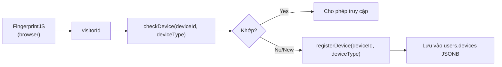

Cấu trúc `users.devices`:
```json
{
    "mobile": { "device_id": "abc123" },
    "desktop": { "device_id": "xyz789" }
}
```

---

## 16. API Routes tổng hợp

### Test Flow

| Method | Route | Handler |
|--------|-------|---------|
| POST | `/api/test-flow/start` | Bắt đầu/resume bài thi |
| POST | `/api/test-flow/save-draft` | Auto-save đáp án |
| POST | `/api/test-flow/submit` | Nộp bài + chấm điểm |

### Admin (requireAdmin)

| Method | Route | Handler |
|--------|-------|---------|
| GET/POST/PUT/DELETE | `/api/admin/quizzes/*` | Quiz CRUD |
| GET/POST/PUT/DELETE | `/api/admin/users/*` | User management |
| GET/POST/PUT/DELETE | `/api/admin/orders/*` | Order management |
| GET/POST/PUT/DELETE | `/api/admin/posts/*` | Blog CRUD |
| GET/PUT | `/api/admin/home/*` | CMS editor |
| GET/PUT | `/api/admin/subscription/*` | Pricing config |
| GET/PUT | `/api/admin/settings/*` | Site settings |
| GET/POST | `/api/admin/coupons*` | Coupon CRUD |
| GET | `/api/admin/dashboard` | Dashboard stats |

### Public

| Method | Route | Handler |
|--------|-------|---------|
| POST | `/api/orders/create` | Tạo đơn hàng |
| POST | `/api/coupons/validate` | Validate mã giảm giá |
| POST | `/api/contact` | Gửi email liên hệ |
| POST | `/api/affiliate/register` | Đăng ký affiliate |
| POST | `/api/webhooks/sepay` | Webhook thanh toán |

---

> [!TIP]
> **Để tìm code nhanh:**
> - Business logic → `services/` folder
> - Database types → `services/types/database.ts`
> - API routes → `pages/api/`
> - UI components → `src/` (Feature-Sliced Design)
> - Auth helpers → `lib/`
